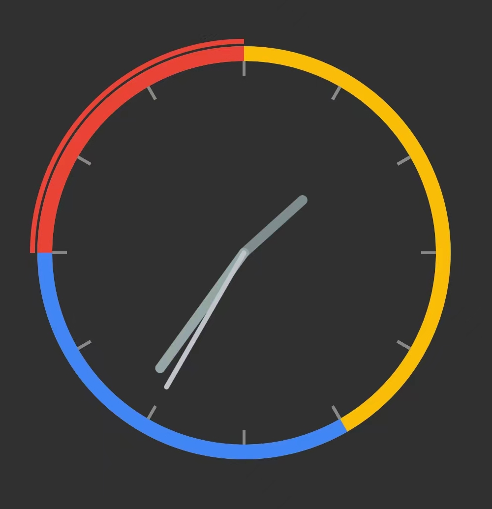

# Clock views


**Fork of some Android clock open source projects.**

## Gradle

 [](https://central.sonatype.com/artifact/cn.lalaki/clock-views/)

```kts
implementation("cn.lalaki:clock-views:1.0.1")
```

## About

| Project  | Demo |  License |
|:----------| :-----: |:------|
| [huteri/analogclock](https://github.com/huteri/analogclock)  | [link](#analogclock) | [](https://www.apache.org/licenses/LICENSE-2.0.html) |
| [CROSP/circle-time-view](https://github.com/CROSP/circle-time-view) | [link](#circle-time-view) | [](https://www.apache.org/licenses/LICENSE-2.0.html) |
| [arbelkilani/Clock-view](https://github.com/arbelkilani/Clock-view) | [link](#Clock-view) | [](https://github.com/arbelkilani/Clock-view/blob/master/LICENSE) |
| [rosenpin/custom-analog-clock-view](https://github.com/rosenpin/custom-analog-clock-view) | [link](#custom-analog-clock-view) | [](https://github.com/rosenpin/custom-analog-clock-view/blob/master/LICENSE) |

## analogclock
+ ### Demo
+ 

    + ### layout
    ```xml
    <cn.lalaki.desk.view.AnalogClockView
      android:layout_width="300dp"
      android:layout_height="300dp" />
    ```

## circle-time-view
+ ### Demo
    

    + ### layout
    ```xml
    <cn.lalaki.desk.view.CircleTimeView
      android:layout_width="350dp"
      android:layout_height="350dp"/>
    ```

## Clock-view
+ ### Demo
    

    + ### layout
    ```xml
    <cn.lalaki.desk.view.Clock
      android:layout_width="wrap_content"
      android:layout_height="wrap_content"/>
    ```

## custom-analog-clock-view
+ ### Demo

    

    + ### layout
    ```xml
    <cn.lalaki.desk.view.CustomAnalogClock
        android:layout_width="wrap_content"
        android:layout_height="wrap_content" />
    ```

## The End
